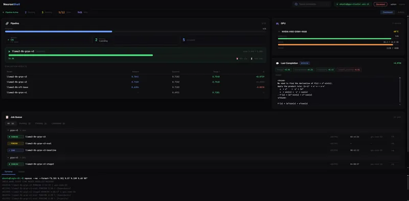

<div align="center">

# NeuronShell

**A modern web dashboard to monitor and manage ML training pipelines on remote GPU clusters via SSH.**



</div>

---

## Overview

NeuronShell is a self-hosted web shell designed for researchers and engineers running SLURM-based training experiments on remote GPU clusters. It provides a real-time dashboard with live SSH connectivity, GPU telemetry, job queue monitoring, pipeline progress tracking, and an integrated terminal — all from the browser, with no VPN or X11 forwarding needed.

---

## Features

### 🔗 Pipeline Monitor

- Real-time progress bar tracking how many models in the pipeline have completed
- Watcher daemon status (PID, active/idle) that auto-launches the training chain
- Summary of running, pending, and completed SLURM jobs at a glance
- Live active-job card with step counter, elapsed time, and ETA

### 📊 Evaluation Results Table

- Side-by-side comparison of reward, baseline, and Stage 1 metrics for every model
- Color-coded delta column (green = improvement, red = regression)
- Updates automatically whenever the watcher writes new results

### 🎮 GPU Monitor

- Per-GPU utilization, VRAM usage, temperature, and power draw
- Animated progress bars with color-coded thresholds (green → yellow → orange → red)
- Live updates streamed over WebSocket — no polling

### 💬 Last Completion Viewer

- Shows the most recent model output from the training loop
- Reward breakdown per criterion (format, correctness, reasoning, penalties)
- Expandable prompt and raw completion with schema metadata

### 📋 Job Queue

- Full SLURM job list with state badges (RUNNING, PENDING, COMPLETED, FAILED)
- Jobs grouped by model run for easy navigation
- One-click `Info` and `Log` buttons to fetch job details or tail log files directly into the Output panel
- Filterable by state (All / Running / Pending / Completed)

### 💻 Integrated Terminal & Output Panel

- Browser-based xterm.js terminal connected to the remote host over SSH
- Dedicated Output panel for structured command results (job info, log tails)
- Resizable and collapsible bottom panel

### 🔍 Command Palette

- `Ctrl+K` shortcut to search and trigger any dashboard action
- Keyboard-first navigation for power users

### 🔐 Authentication

- Session-based login with hashed password (no plaintext secrets)
- SSH credentials stored server-side only, never exposed to the client

---

## Tech Stack

| Layer     | Technology                                                             |
| --------- | ---------------------------------------------------------------------- |
| Frontend  | [SvelteKit](https://kit.svelte.dev/) + TypeScript                      |
| Styling   | [Tailwind CSS v4](https://tailwindcss.com/) with custom design tokens  |
| Terminal  | [xterm.js](https://xtermjs.org/)                                       |
| SSH       | [ssh2](https://github.com/mscdex/ssh2) (Node.js)                       |
| Real-time | Native WebSocket (custom Vite plugin for dev, Node.js server for prod) |
| Auth      | Cookie-based sessions with bcrypt password hashing                     |
| Runtime   | Node.js (SvelteKit adapter-node)                                       |

---

## Getting Started

### Prerequisites

- Node.js 18+
- Access to a SLURM cluster via SSH

### Install & Run

```bash
git clone https://github.com/GiuseppeBellamacina/NeuronShell.git
cd NeuronShell
npm install
npm run build
node build/index.js
```

For development with hot reload:

```bash
npm run dev
```

### Configuration

Create a `.env` file in the project root:

```env
PASSWORD_HASH=<bcrypt hash of your password>
SESSION_SECRET=<random secret string>
PORT=3000
```

Generate the password hash:

```bash
npx tsx scripts/hash-password.ts
```

Then open `http://localhost:3000`, log in, and connect to your cluster via the SSH modal.
